


 

**[Portfolio](https://asadamadsh.me)** &nbsp;·&nbsp; **[ParchiVisa, live](https://parchivisa.app)** &nbsp;·&nbsp; **[Case studies](https://asadamadsh.me/work/parchivisa)** &nbsp;·&nbsp; **[CV](https://asadamadsh.me/cv.pdf)** &nbsp;·&nbsp; **[LinkedIn](https://linkedin.com/in/asadamadsheikh)** &nbsp;·&nbsp; **[Book a call](https://cal.com/asad-amad-rvz7vg)**

 

I build software for startup founders: web apps, AI features and payment systems, from the first schema to production. Then I stay and run it.

The proof is **[ParchiVisa](https://parchivisa.app)**, an AI visa-readiness product I designed, built, deployed and still run, alone. It went from idea to production in six weeks, and I am the only engineer on it. Before that I spent two summers on production systems at Frontier Works Organization and Ufone, and I graduated in Computer Science from FAST NUCES in June 2026.

Everything below is checkable. Each card says what a project really is, whether live, client work, simulated or not yet deployed, and the last section lists where to verify every number.

- **Running now:** ParchiVisa, in production on AWS Lightsail.
- **Building next:** Cascade's Adyen adapter with soft-decline routing, a double-entry ledger and a React dashboard.
- **Open to:** founders who need a system built and someone to stand behind it. First project: about one week.
- **Based in:** Islamabad, UTC+5. Core hours are set around founders in North America and Europe.
- **Ask me about:** idempotency and webhook reliability, scoring engines with hard gates, LLM features with a deterministic core, Postgres under load.

 

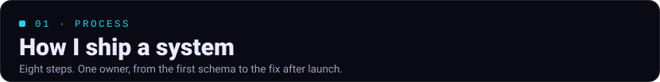

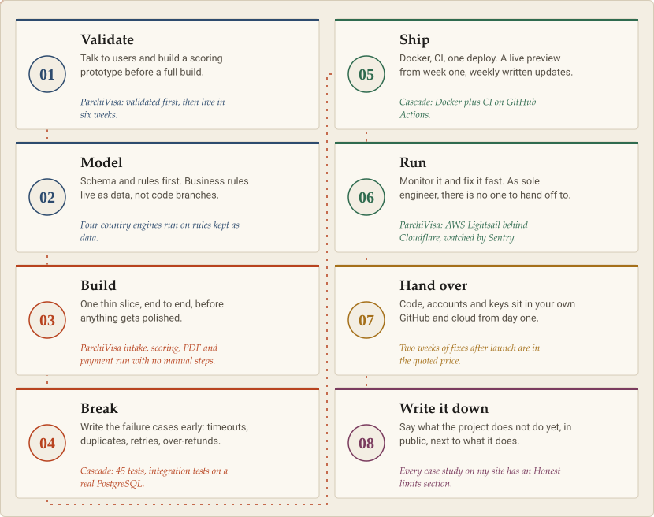

 

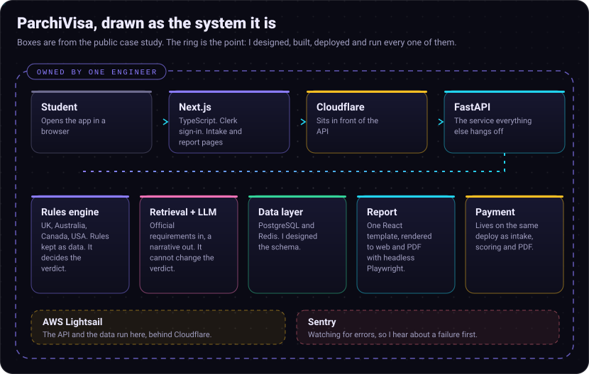

What I put in writing on every engagement:

1. A live preview from week one and a written update every week.
2. Code, accounts and keys live in **your** GitHub and cloud from day one.
3. Two weeks of fixes after launch are included in the quoted price.

 


 

<a href="https://asadamadsh.me/work/parchivisa">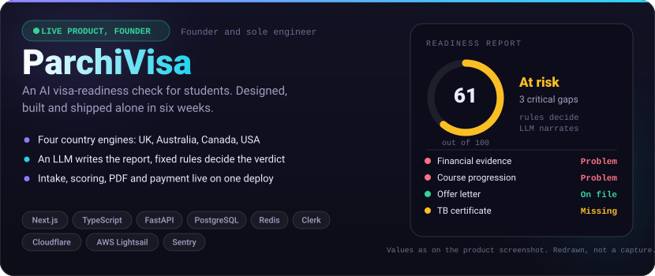</a>

<a href="https://asadamadsh.me/work/influencepay">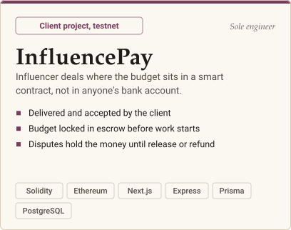</a>
<a href="https://asadamadsh.me/work/cascade">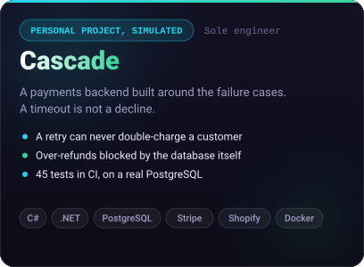</a>

<a href="https://asadamadsh.me/work/vehiclewatch">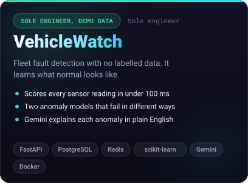</a>
<a href="https://asadamadsh.me/work/veriloom">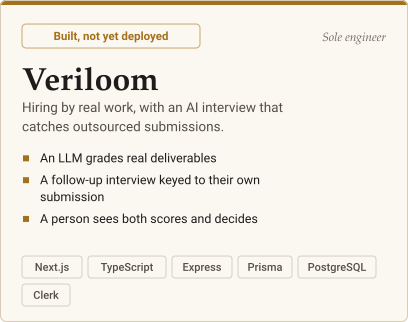</a>

| System | What it honestly is | Look |
| --- | --- | --- |
| **ParchiVisa** | Live product. Founder and sole engineer. The source is not public. | [parchivisa.app](https://parchivisa.app) · [case study](https://asadamadsh.me/work/parchivisa) |
| **InfluencePay** | Client project, delivered and accepted. Runs on the Sepolia test network. Not launched. | [case study](https://asadamadsh.me/work/influencepay) · [code](https://github.com/asadsheikh91/influence) |
| **Cascade** | Personal project on simulated data. A rehearsal of a Laravel to .NET payments migration. | [case study](https://asadamadsh.me/work/cascade) · [code](https://github.com/asadsheikh91/cascade-payments) |
| **VehicleWatch** | Sole engineer, demo data. No labels, so no precision or recall to quote yet. | [case study](https://asadamadsh.me/work/vehiclewatch) · [code](https://github.com/asadsheikh91/vehicle-watch) |
| **Veriloom** | Built, not yet deployed. No real candidate has been through it. | [case study](https://asadamadsh.me/work/veriloom) · [code](https://github.com/asadsheikh91/VeriLoom) |

 

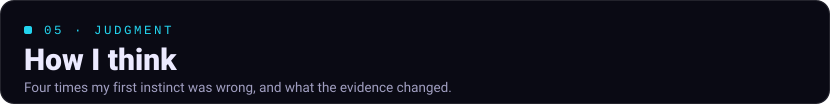


Longer write-ups: [When proportional scoring hides a hard failure](https://asadamadsh.me/notes/band-capping-scoring) · [Timeouts that weren't the query's fault](https://asadamadsh.me/notes/connection-pool-timeouts) · [Choosing an algorithm by what the data doesn't have](https://asadamadsh.me/notes/unlabelled-fault-detection) · [Cascade ADR: a PSP timeout is not a decline](https://github.com/asadsheikh91/cascade-payments/blob/main/docs/adr/0002-psp-timeout-is-not-a-decline.md)

 

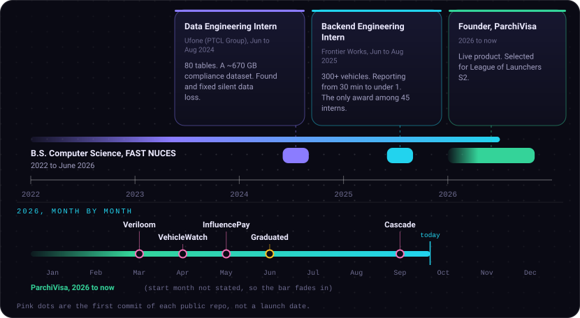

 

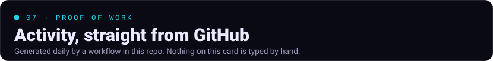


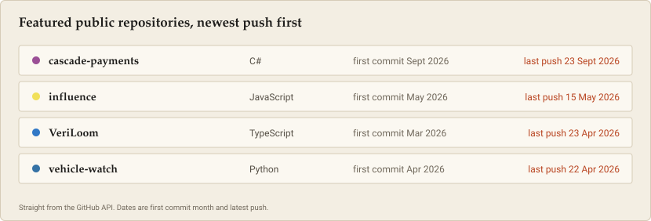


A green square is not a measure of anyone. The part that does not fit in a graph: ParchiVisa runs in production, and I am the only engineer on call for it.

 

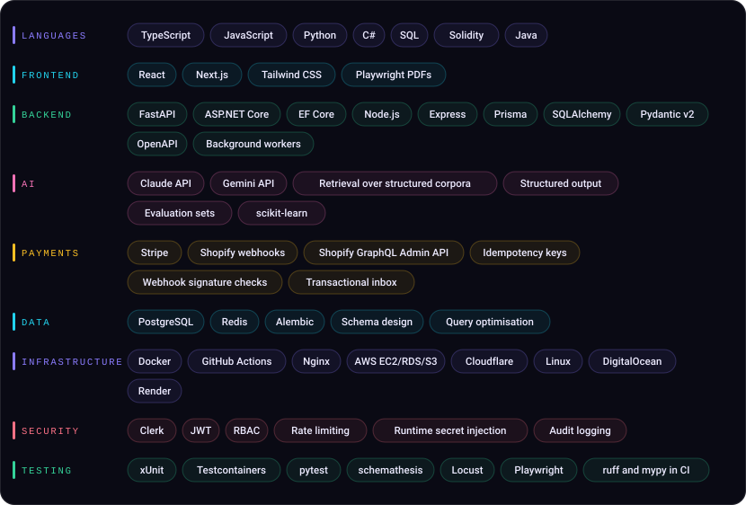

 

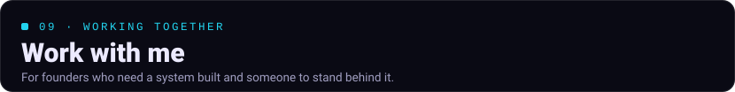

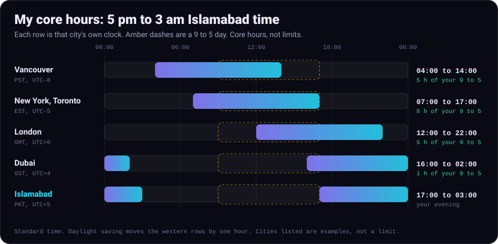

<a href="https://cal.com/asad-amad-rvz7vg">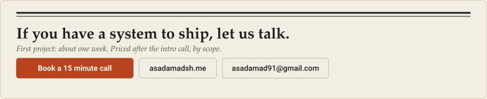</a>

 

<b>Verify every claim</b>

 

| Claim | Where to check it |
| --- | --- |
| ParchiVisa is live, built and shipped alone in six weeks | [parchivisa.app](https://parchivisa.app) and the [case study](https://asadamadsh.me/work/parchivisa) |
| Four country engines: UK, Australia, Canada, USA | The [case study](https://asadamadsh.me/work/parchivisa) |
| Selected for League of Launchers S2, National Incubation Centre Islamabad | The [CV](https://asadamadsh.me/cv.pdf) |
| 300+ vehicles, reporting from 30 minutes to under 1, sole Certificate of Appreciation among 45 interns | The [CV](https://asadamadsh.me/cv.pdf) and the [connection pool note](https://asadamadsh.me/notes/connection-pool-timeouts) |
| 80 tables and a ~670 GB compliance dataset at Ufone | The [CV](https://asadamadsh.me/cv.pdf) |
| 45 tests on a real PostgreSQL | [`tests/`](https://github.com/asadsheikh91/cascade-payments/tree/main/tests) and the [CI workflow](https://github.com/asadsheikh91/cascade-payments/blob/main/.github/workflows/ci.yml) in Cascade |
| Over-refunds are blocked by the database | The CHECK constraints in Cascade's [migration](https://github.com/asadsheikh91/cascade-payments/tree/main/src/Cascade.Api/Data/Migrations) |
| First-commit dates on the timeline | Each repo's commit history |
| Working hours | 5 pm to 3 am PKT is 12:00 to 22:00 UTC. The overlap chart is arithmetic on that window. |

Rules I keep for this profile: no number without a source, no project described as more than it is, and the limits go next to the strengths. If something here looks wrong, tell me and I will fix it.

<b>How this profile is built</b>

 

The visuals are hand-designed SVGs generated from one data file, so the facts live in one place.

- [`data/profile.json`](data/profile.json) holds every fact. Nothing is typed into a graphic by hand.
- [`scripts/build-art.mjs`](scripts/build-art.mjs) draws the banner, diagrams, cards and timeline from that data. No dependencies.
- [`scripts/update-live.mjs`](scripts/update-live.mjs) reads the GitHub API and the public contribution calendar, and draws the three live cards.
- [`.github/workflows/update-profile.yml`](.github/workflows/update-profile.yml) refreshes the live cards every day and commits only when something changed.

Everything is self-contained: no external image hosts, fonts or scripts, so nothing here can break because someone else's server went down.

